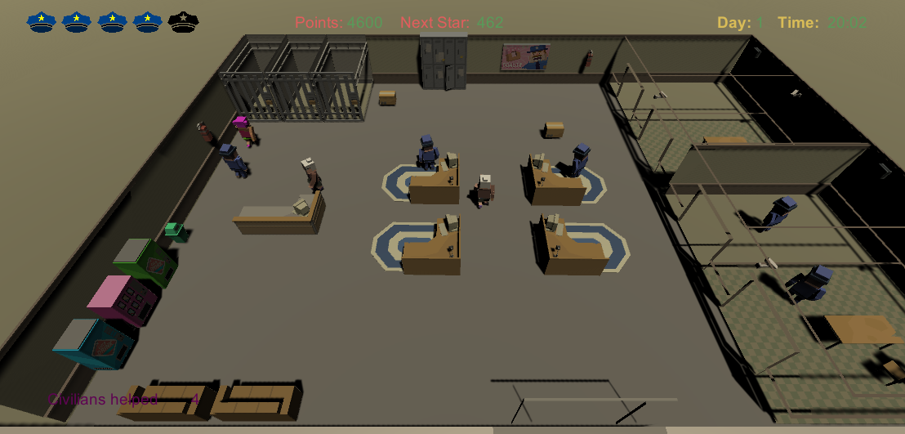
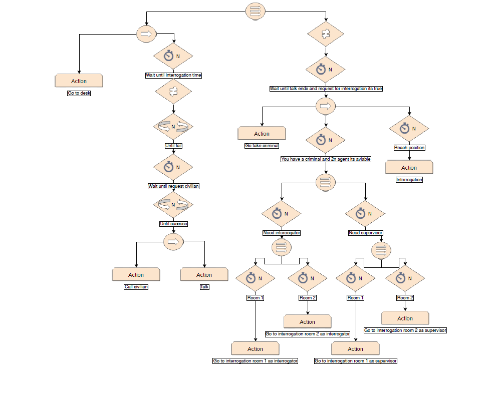
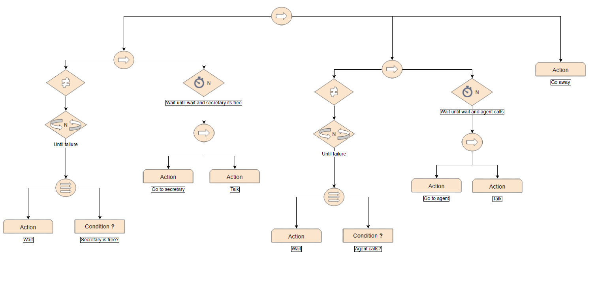
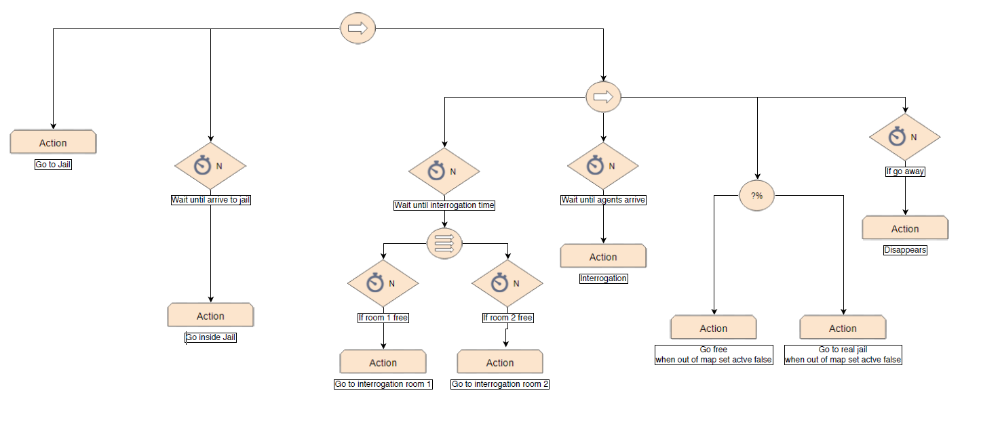

# Fuck The Police

Fuck The Police is a management game developed by [Alejandro París](https://github.com/AlejandroParis) and [Cere Venteo](https://github.com/CereVenteo) for the AI subject under the supervision of the lecturer [Marc Garrigó](https://github.com/markitus18). 


- Download the latest release [HERE](https://github.com/CereVenteo/Fuck-the-Police/releases)

- Github Repository: [Respository](https://github.com/CereVenteo/Fuck-the-Police)

## The Team

- [Alejandro París](https://github.com/AlejandroParis) - Design and Code
- [Cere Venteo](https://github.com/CereVenteo) - Design and Code

## The Game
<br>

### Description
In this game we will be in charge of running a police station.

Supervising all our officers, detectives and field agents will maintain control over all the crime in our city.

### Rooms:
- Reception
- Waiting Room
- Office Space
- Cells
- Interrogation Room
	
### Characters:
- Policeman
- Citizens
- Secretary
- Criminals
- Cars

### The Assigment 2 Contain

In this demo we will have the possibility to acquire with points: police cars, cages for criminals and desks for police.

At the beginning of the game, we will see how the agents go to work at their desks.
The civilians will come to request help and the comrades will bring us criminals for interrogation.

To process the civilians we will have to wait until they take a turn at the secretary and then click on an agent to call some civilian in turn to help him.
When civilians are waiting with their assigned turn they will wander nervously around the waiting area.

To carry out an interrogation we will need to have 2 free agents in addition to the interrogation rooms, then we will click on a criminal that we have locked up and if the conditions are met we will proceed with the interrogation.

When the day ends we can see how civilians and the secretary leave the police station but the agents and criminals continue in it to carry out interrogations.

For each civilian processed and each interrogation complete we will receive the points that we can use to buy accessories for the police station, with the final objective of achieving the 5 stars and declare ourselves as the best police station in the county.

### Innovation

- It is possible that at some point in a random way a civilian sneaks in to get his turn in the secretary.
- All the characters in their behavior interact with each other.
- Camera with multiple controls

### Controls

- W, A, S and D: move the camera
- Move mouse towards the sides of the screen: move the camera
- Click: 
	- On agent makes a menu appear if conditions are met
	- On criminal makes a menu appear if conditions are met
	- On menu activates an action

### Behaviour Trees

#### Agent Behaviour Tree
- Download [Agent Behaviour Tree](https://github.com/CereVenteo/Fuck-the-Police/docs/Agent_Behaviour_Tree.pdf)
<br>

The agent starts by going to his desk.

When there are civilians waiting to be served if you press the call button, a civilian arrives at his desk and starts to solve his problem.

If there is a criminal in the cell and you press the criminal's call button, then two free agents leave your desk to interrogate the criminal, one goes to pick up the criminal from his cell and takes him to the interrogation room to interrogate him, the other goes to the supervisory room to take notes on the interrogation. If interrogation room 1 is occupied, they will go to room 2.

#### Civilian Behaviour Tree
- Download [Civilian Behaviour Tree](https://github.com/CereVenteo/Fuck-the-Police/docs/Civilian_Behaviour_Tree.pdf)
<br>

The civilians enter the police station and wait until the secretary is free, when she is free, talk to her to give her a waiting time.

Wait in the waiting area until an agent calls you.

When they call him, he goes to talk to the agent and tells him about his problem. The agent solves it and the civilian goes home.

#### Criminal Behaviour Tree
- Download [Criminal Behaviour Tree](https://github.com/CereVenteo/Fuck-the-Police/docs/Criminal_Behaviour_Tree.pdf)
<br>

When a criminal is arrested, an agent accompanies him to a cell that is empty and go inside cell.

If you press the call button of a criminal, an agent will take him out of his cell to take him to the interrogation room that is empty.

After being questioned, randomly, he is released or taken to a jail to be locked up permanently.

When he goes out of the camera, he disappears.

## License

```
MIT License

Copyright (c) 2019 Alejandro París and Cere Venteo

Permission is hereby granted, free of charge, to any person obtaining a copy
of this software and associated documentation files (the "Software"), to deal
in the Software without restriction, including without limitation the rights
to use, copy, modify, merge, publish, distribute, sublicense, and/or sell
copies of the Software, and to permit persons to whom the Software is
furnished to do so, subject to the following conditions:

The above copyright notice and this permission notice shall be included in all
copies or substantial portions of the Software.

THE SOFTWARE IS PROVIDED "AS IS", WITHOUT WARRANTY OF ANY KIND, EXPRESS OR
IMPLIED, INCLUDING BUT NOT LIMITED TO THE WARRANTIES OF MERCHANTABILITY,
FITNESS FOR A PARTICULAR PURPOSE AND NONINFRINGEMENT. IN NO EVENT SHALL THE
AUTHORS OR COPYRIGHT HOLDERS BE LIABLE FOR ANY CLAIM, DAMAGES OR OTHER
LIABILITY, WHETHER IN AN ACTION OF CONTRACT, TORT OR OTHERWISE, ARISING FROM,
OUT OF OR IN CONNECTION WITH THE SOFTWARE OR THE USE OR OTHER DEALINGS IN THE
SOFTWARE.
```

